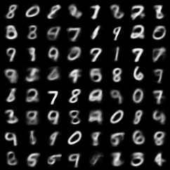
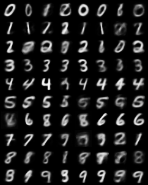
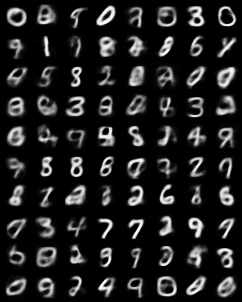
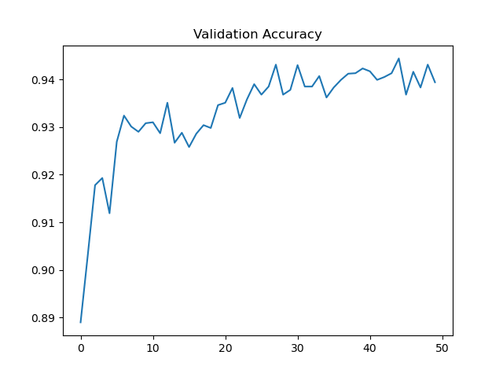
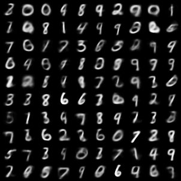
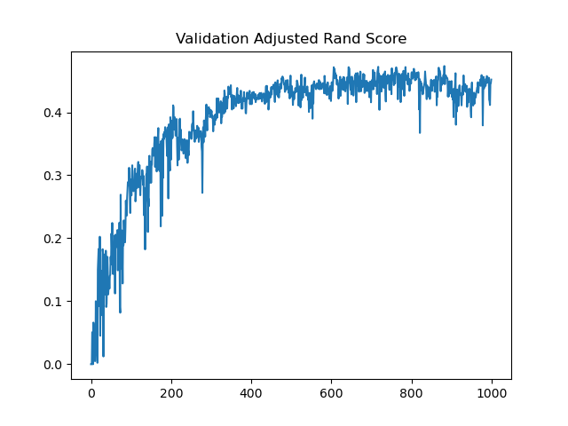
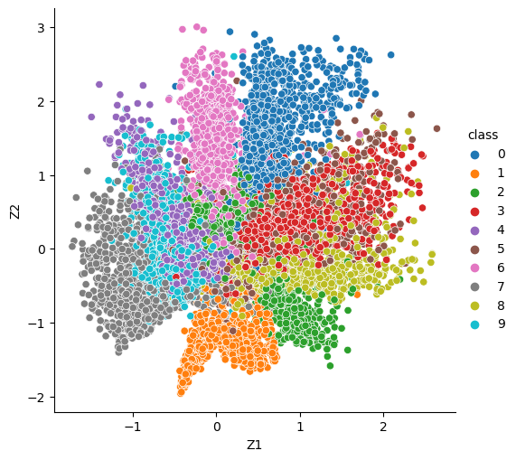

# Adversarial Autoencoders

对抗自编码器(AAE)的实现，实现细节与原文章略有不同，但基本思想一致。

## Pure AAE

```bash
python main.py
````

结果展示：



注意事项：

* 没有添加BatchNorm
* 使用dropout可以提高图片的清晰度


## Supervised AAE

```bash
python main.py --task supervise --code_dim 10
```

结果展示：



注意事项：

* 将code_dim(即representation的维度)设置的小一点，不然很多类别的信息将被储存到其中


## Semi-Supervised AAE

```bash
python main.py  --task semisupervise --code_dim 10
```

结果展示：






## Unsupervised AAE

`````bash
python main.py --task unsupervise --bs 2560 --epoch 1000
```

结果展示：






注意事项：

* 需要较长时间的训练


## Embed and visualization

```bash
python main.py --task embed --code_dim 2 --epoch 500 --bs 2560
```

结果展示：


